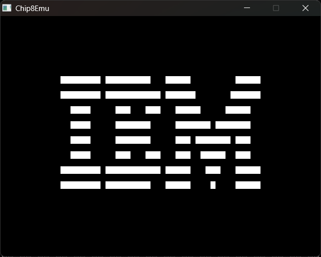

# chip8

A simple Chip8 emulator written in C.

## Requirements
- meson
- sdl3

## How to compile

<details>
<summary>Linux</summary>

```bash
# Clone the repo
$ cd chip8
$ meson setup build && cd build
$ meson compile
```

And then run `chip8 <rom>`.
</details>

<details>
<summary>Windows</summary>

On Windows be sure to have installed all the packages using `vcpkg` (remember `pkgconf`).

```bash
# Clone the repo
$ cd chip8
$ meson setup build --native-file meson-vcpkg.txt && cd build
# Copy all the DLL from the vcpkg/installed/x64-windows/bin/ folder to build/
$ meson compile
```

And then run `chip8 <rom>`.
</details>

### IBM Example

